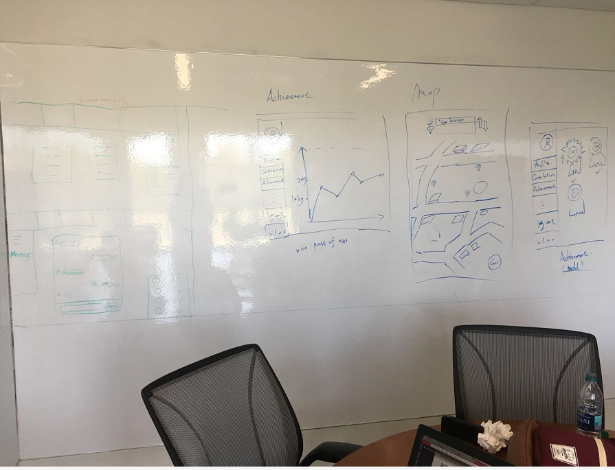
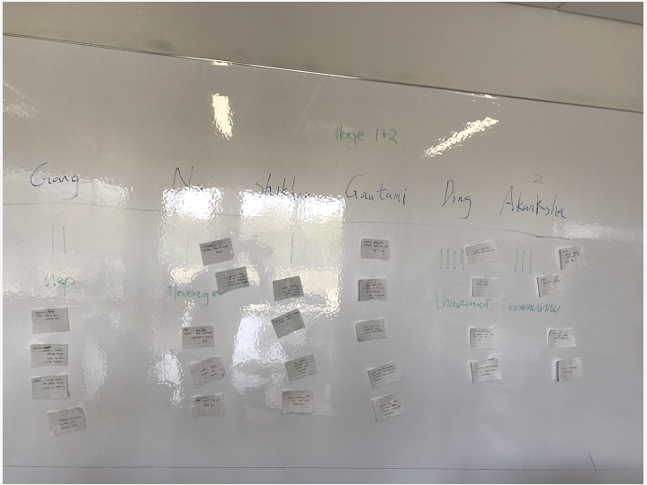
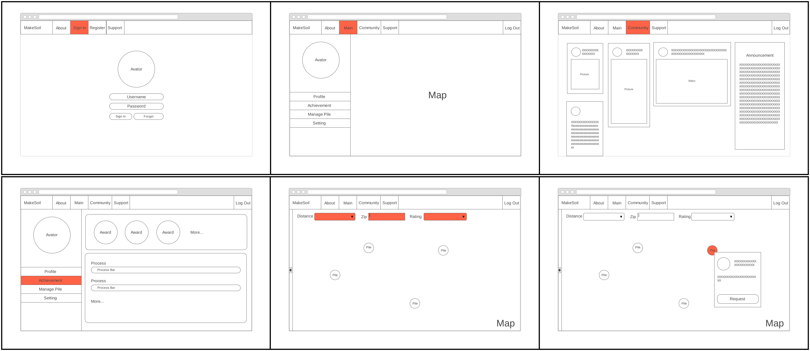

# Choose #

## Team ##

| Name                 	| Role		    | Contribution |
| :---                 	| :---         	| :---         |
| Gautami Khandekar	   	| Member | All involved  |
| Gang Zhang		   	| Member | All involved	 |
| Akanksha Singh	   	| Member | All involved  |
| Na Wen				| Member | All involved	 |
| Shikhar Sharma   		| Member | All involved	 |
| Xiangqing Ding		| Member | All involved	 |

## Solutions ##

## Voting ##

We decided to combine the message board and user message system as a community, where the user can interact with each other by post their experience and advice. For the safety of our user, we decided when a soil supplier wants to provide food waste to a soil maker, the supplier will have to request the location from soil maker.  In this way, soil maker’s information will be more protected.  We also decided to use the filter system in our map for soil supplier to find the nearest soil maker in that area.  Achievement also plays a large role in this platform since we want to give a more rewarding feeling to our user by tracking their donation amount.  

**Capture:**

## Critique ##

### Akanksha Singh ###

**Community**

+ Great idea to motivate. 
+ Too many features like articles, videos, news, tutorials, following others, publishing content, chat etc. Focus on one or two main ideas- chat/ messaging, articles.
+ For chat use features such as online/ offline/ away, last seen, message seen etc.
 
**Achievement**

+ Good idea. Not sure if we will have sufficient data to implement for now. May be good for future expansion.
+ Need to decide metrics. How many kgs of soil == 1 point? How many points for each level? How many levels?
+ Need to develop a robust system to collect data (overhead?).
+ Having few pictures is good and feasible.
+ Virtual money and buying gifts does not align with the vision (MakeSoil should not be for monetary benefit).

**Map**

+ Very useful feature to search and filter based on distance and available time.
+ Navigation may not be a good idea as everyone uses/ trusts Google maps.
+ Idea- star favorite soil makers. Your favorites are automatically highlighted on the map.

### Na Wen ###

**Community**

+ Like the idea, only not so sure about the format of the community.
+ I think it should just display something like the other communities so we can keep things consistent for easier usability.
+ Message can be combined with community so user can communicate in the community at the same time.
+ I like the idea user need to request for a location, that way a user’s information will not just shared publicity.
+ Add a invite friend function.

**Achievement**

+ Like the layout of the achievement section.
+ Not sure if the website will keep all of the data for all the user.
+ I do not think we can keep track of how many waste or soil a person contributed, since I think we need to keep the make soil concept simple, requiring a user to weight his/her food waste every time might not be a simple task for all soil supplier.

**Map**

+ Do not think navigation is necessary.
+ Like the filter idea, it will be must have for the website.

### Gang Zhang ###

**Community**

+ Need clearly divide different community zone. Such as articles videos, new, tutorials etc. So we can hide some less frequently used function zone.
+ Community is a key part to have a good environment to attract others to involve in it.

**Achievement**

+ Need to have clear vision what the man have done and what the man can do next.
+ Medal is a great idea to encourage people to do more in the community.
+ We can have a community rank to encourage people.
+ Gift would be a good idea to better our make soil community.

**Map**

+ We can Google map to replace our map function. People can just use Google map to navigate.
+ Map could show the nearby make soil station where you can reach but not how to navigate how to go there.

### Gautami Khandekar ###

**Community**

+ In support of this feature. It would facilitate easy communications between different soil users and makers and provide them with a platform to share their experiences.
+ A chat box can probably be a good idea to enable community interactions.

**Achievement**

+ This feature seems good but there seems less feasibility for its implementation.
+ The metrics deciding the rank of soil makers are hard to define.
+ Also, since MakeSoil is an initiative for a social cause, monetary factors should not be involved to encourage people to make soil.

**Map**

+ Interfacing with Google maps seems a good feasible idea to help users navigate to the nearby soil makers.
+ The filter idea based on distance and availability of MakeSoil users will lead to a better user-friendly application.

### Shikhar Sharma ###

**Community**

+ Association in a community would be a tough idea to implement, since many such communities already exists, and go unnoticed due to lack of participation. Hence, solid prodding for participation is required.
+ Streamlining info sharing might play central role, to keep focus on topic. Since, many discussions diverge from the main topic.
 
 
**Achievement**

+ Highly motivational idea.
+ Metric of achievement rating is tough to decide upon.
+ Linking virtual money to free gifts from sponsors (big organizations or money earned from advertisements) can be a good idea.
 
**Map**

+ Map is seemingly the most useful tool for any system requiring navigation.
+ The only problem is exact location sharing, many users might not be comfortable with which.
+ Good idea, easy to implement. All that required is interfacing with Google maps.

### Xiangqing Ding ###

**Community**

+ Building a community among users could improve their sense of belongings.
+ The products need a place to share experience and information. The Community feature is necessary to the product.
+ Current thoughts about Community sounds complete to me.
+ Could we use other social network application to replace the Community feature, like Facebook? This should be considered.
 
 
**Achievement**

+ Though sounds attractive, Achievement is new feature to our client. Adding new features may change the current design of the product.
+ Actually the main focus for this product is helping users find each other. Putting too much focus on Achievement is contrary to the original intention.
+ This feature should be in lower priority compared with Map and Community.
 
**Map**

+ Map is definitely necessary for our product, from my perspective.
+ Current thoughts about Map functions are good, but still I expect to see something out of box.
+ Embedded navigation function could improve the efficiency of the product, since users do not need to copy the address to other navigation application again.

## Final Story Board ##

The story board mainly consists of six essential pages of the application: Logging In Page, Main Page (after logging in), Community page, Achievement page and Map page. 

Firstly users need to log in to use the application. After logging in, it will direct to the main page. The main page contains a user panel and map panel. In the navigation bar, user could choose to go to the community page and view posts. Also users can see their achievement in the side bar. User could also expand the map and use the filter to get more accurate locations. By clicking the point on the map, user could view detailed information about the pile and make request.

## References ##

MakeSoil Official Website: [http://makesoil.org/](http://makesoil.org/)