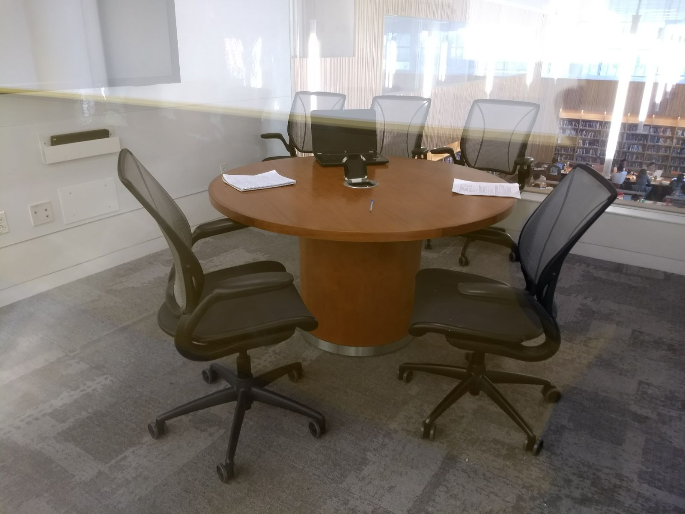
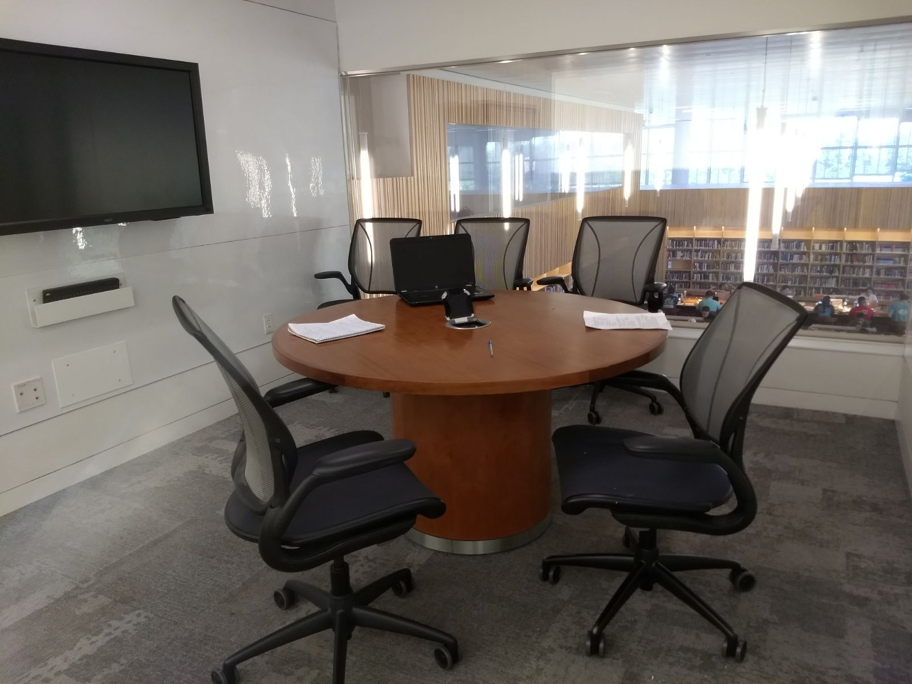

# Evaluate #

## Team ##

| Name                 	| Role		    | Contribution |
| :---                 	| :---         	| :---         |
| Gautami Khandekar	   	| Member 		|  Interview, Observation |
| Gang Zhang		   	| Member 		|  Interview, Observation |
| Akanksha Singh	   	| Facilitator 	|  Interview, Observation |
| Na Wen				| Member 		|  Interview, Observation |
| Shikhar Sharma   		| Member 		|  Interview, Observation |
| Xiangqing Ding		| Member 		|  Observation, Document |

### Context ###

### Participants ###

Five people are invited by our group members to attend the interview. The participants are all friends of our group member, and four of them come from NCSU. Before the interview, participants are required to complete a survey about their background. The results are listed as below.

| Interviewee     | Gender     | Age   | Experience of mobile application? | Experience of similar application? | Knowledge of UX? | Number of application  used | Like comparing/commenting applications? |
| :---            | :---     	| :--- 	| :---         | :---         | :---         | :---         | :---         |
| Interviewee 1   | Male		| 25	|  Yes | No  | Yes | 10 - 20 | No  |
| Interviewee 2   |	Male		| 24	|  Yes | Yes | No  | 20 - 50 | Yes |
| Interviewee 3   | Male		| 25	|  Yes | No  | Yes | 10 - 20 | No  |
| Interviewee 4   | Female		| 23	|  Yes | Yes | No  | 20 - 50 | Yes |
| Interviewee 5   | Male		| 24	|  Yes | No  | No  | 10 - 20 | Yes |

Among all the characteristics, we list the wanted characteristics and unwanted characteristics. 

| Wanted Characteristic         | Neutral Characteristic |  Unwanted Characteristic |
| :---                 			| :---         			 | :---         			  |
| 1. Has experience of mobile application   2. Has experience of similar application   3. Has used many applications   4. Like comparing/commenting applications |  1. Has knowledge of UX | 1. Unbalanced gender ratio   2. Similar age   3. Similar education level   |

### Lab ###

The interviews were held in the study rooms (shown in following pictures) in The James B. Hunt Jr. Library. We prepared a laptop used for presenting the prototype to interviewees. In addition, phone (for recording), pens and papers are prepared for documenting the interview. In each interview, there is one interviewee, one interviewer, and three observers.The observers are responsible observing the interviewees' reaction and recording the interview.

## Interviews Script ##

The following interview scripts are mainly documented based on the audio recording. The interviews generally begins with greeting. Then the interviewer will ask the interviewee the most impressive feature of the prototype in his/her mind. After that, interviewee will be asked about their overall opinion and suggestion about the prototype.

### Interview 1 ###

**Interviewer:** Hello. How are you?

**Interviewee:** Hi ! I am doing very well. Thank you. What about you?

**Interviewer:** Doing great! So today we are here for a survey on our MakeSoil application. This is basically a platform for the users to reach out to the soil makers and manage the soil supply and demand. It also facilitates community interactions to enrich the user experience. We have a prototype ready for this application that needs to be tested. The prototype is not an end-to-end working model of the application, but will just give a fair idea of how the application flow will be. So any suggestions and comments about the current scope of the prototype will help improve the overall experience.
So here is the prototype. You can navigate through the different menus and explore the different options provided in the application.
Who do you think can the user group for the prototype?
Interviewee: The prototype can be most useful to the farmers who are looking for good organic soil. It can also be useful to home gardeners who are looking to grow crops or plants in their gardens.

**Interviewer:** What are the features of the prototype that you found the most impressive?

**Interviewee:** The prototype is easy to use and the community feature is an add-on feature that will enable people to share their experiences. It is a good channel for the soil makers to reach out to the consumers and encourage organic soil cultivation.

**Interviewer:** How is the user experience of the prototype?

**Interviewee:** The prototype is easy to use and the features are self-explanatory. Overall, it provides an excellent user friendly application environment.

**Interviewer:** What changes/additions are needed in the prototype to make it better?

**Interviewee:** For the current scope, the prototype provides most of the features that will lead to a good user experience. As a future initiative, we can give the soil makers ratings based on the quality of soil that they produce. This will help the users make their decisions regarding whom to take the soil from.

### Interview 2 ###

**Interviewer:** Hi. How are you?

**Interviewee:** Good ! How are you?

**Interviewer:** Good! Today we are here for a survey on our MakeSoil application. This is an app for the users to reach out to the soil makers and manage the soil supply and demand. It also facilitates community interactions to enrich the user experience. We have designed a prototype. Now it needs to be tested. This prototype is not an end-to-end working model of the application, but will just cover the basic idea of how the application flow will be. So any suggestions and comments about the current scope of the prototype will help us better the user experience.
So here is the prototype. You can navigate through the different menus and explore the different options provided in this app.
Who do you think can the user group for the prototype?

**Interviewee:** I think the soil makers could be those who have mastered the alchemy of turning scraps into living soil. And the soil supporters should be those who no longer want to send food waste to landfill. 

**Interviewer:** What are the features of the prototype that you found the most impressive?

**Interviewee:** I really like the achievement page. It shows how many soil makers you have supported and how much scrap you have donated, even the rank around the  community.

**Interviewer:** How is the user experience of the prototype?

**Interviewee:** This app is easy to use, has several functionalities. However, I don’t like the color in this app, I think it’s too dark. 

**Interviewer:** What changes/additions are needed in the prototype to make it better?

**Interviewee:** I think this app is pretty easy. Just help soil makers and soil supporters to communicate with each other. One more feature that would be good is that soil supporter could show what they could provide in their own page, and then soil makers could contact them if they want.

### Interview 3 ###

**Interviewer:** Hi! How are you today?

**Interviewee:** Hey! I’m good. The weather is awesome, so I’m feeling wonderful. How’s it going with you? 

**Interviewer:** Yeah, I liked the weather too. I’m happy that the weather is warm again! Hah!

**Interviewee:** Hah ha! Yeah!

**Interviewer:** Would you like to have something? We have some really good belgian chocolate   cookies, some wafers, and also if you are thirsty, we have sprite coke, natural spring mineral water. Please have some!

**Interviewee:** No, I’m good. Had to attend a meeting before coming here, and had coffee there. I’m good. 

**Interviewer:** That’s great! Well, first of all thanks for taking out your precious time for our interview. Your responses mean a lot to us, and you will be indirectly serving nature, since our product is aimed at having a positive impact on the natural environment. I’m gonna start the interview for our product- MakeSoil. But let me first introduce you to the idea of MakeSoil. MakeSoil,  is a platform that facilitates communication between the creators and supporters of soil. Our product has three main ideas. Soil Makers are those who have mastered the alchemy of turning food scraps into living soil — or those who are learning to. Soil Supporters no longer want to be part of the 35 million tons of food waste sent to landfills each year. They offer their food scraps to nearby heaps, which the Soil Makers shepherd back into nourishing soil. MakeSoil matches Soil Makers and Soil Supporters, and brings them together to make soil. Anyone can sign up as either a Soil Maker or as a Soil Supporter.
You’ll understand more about the product as we move forward with this interview. 
We have a prototype ready for this application that needs to be tested. The prototype is not an end-to-end working model of the application, but will just give a fair idea of how the application flow will be. So any suggestions and comments about the current scope of the prototype will help improve the overall experience.
So here is the prototype. You can navigate through the different menus and explore the different options provided in the application.

Who do you think will be the best user group, for the prototype?
Interviewee: I think the prototype can be best evaluated by the users who are currently working in the areas related to this field, like farm owners/managers, self motivated people who like to grow organic vegetables at home, or the people who are actually making soil. 

**Interviewer:** What are the features of the prototype that you found the most impressive?

**Interviewee:** I found the community and the find feature the most attractive. It give a clear visual of the whole process. By looking at it I am feeling encouraged to find people near me and discuss my interests in soil creation.

**Interviewer:**  How is the user experience of the prototype?

**Interviewee:** I am really impressed with the prototype. In fact, I think I’m gonna some of the ideas for my own projects.

**Interviewer:**  Well, I’m glad you learned something from this. Well, how did you find the feel of it? Did you like the look of it? Did you find it easy to use? How does the prototype make you feel about our project?

**Interviewee:** Ammm…. I kinda feel the idea is great. It was like using an app with good graphics. The look and feel is so similar to popular website designs, that most parts seemed intuitive.

**Interviewer:** What changes/additions do you think will make the prototype better?
Interviewee: Well…. I think…. Lemme think… Haha!! Well, I’m not sure if color really matters here. Does it?

**Interviewer:** Yeah… bring it on. You may suggest whatever you feel like.
Interviewee: I just found it monotonous in terms of colors. Green and black makes it look a little dull. Also if you guys have selected green color only because the product is related to soil and plantation, then it’s kinda cliche. At least in place of black you could choose some other bright colors.

**Interviewer:** Hah!! Yeah… I felt the same. And I am happy that you pointed it out. You are welcome to give any other suggestions about the prototype or this interview.

**Interviewee:** Nah! That’s all from my side.    
               
**Interviewer:** Well, thanks again, for your time and insights. 

**Interviewee:** No problem. I’m happy to be a part of it. 

### Interview 4 ###

**Interviewer:** Hey! How are you today?

**Interviewee:** I’m good. 

**Interviewer:** I like your shirt. Mauve is amy favorite color. And the shirt fits you really well. 

**Interviewee:** Well thanks!

**Interviewer:** Would you like to have something? We have some really good Belgian chocolate   cookies, some wafers, and also if you are thirsty, we have sprite coke, natural spring mineral water.  Please have some!

**Interviewee:** Thanks! I would love to have some cookies. 

**Interviewer:** Sure! Please help yourself.  Well, first of all thanks for taking out your precious time for our interview. Your responses mean a lot to us, and you will be indirectly serving nature, since our product is aimed at having a positive impact on the natural environment.  
I’m gonna start the interview on our product MakeSoil. But let me first introduce you to the idea of MakeSoil. MakeSoil is a platform that facilitates communication between the creators and the supporters of soil. Our product has three main ideas. Soil Makers are those who have mastered the alchemy of turning food scraps into living soil — or those who are learning to. Soil Supporters no longer want to be part of the 35 million tons of food waste sent to landfills each year. They offer their food scraps to nearby heaps, which the Soil Makers shepherd back into nourishing soil. MakeSoil matches Soil Makers and Soil Supporters, and brings them together to make soil. Anyone can sign up as either a Soil Maker or as a Soil Supporter.    
You’ll understand more about the product as we move forward with this survey. 
We have a prototype ready for this application that needs to be tested. The prototype is not an end-to-end working model of the application, but will just give a fair idea of how the application flow will be. So any suggestions and comments about the current scope of the prototype will help improve the overall experience.

So here is the prototype. You can navigate through the different menus and explore the different options provided in the application. Who do you think can the user group for the prototype?
Interviewee: The prototype can be most useful to the farmers who are looking for good organic soil. It can also be useful to home gardeners who are looking to grow crops or plants in their gardens.

**Interviewer:** What are the features of the prototype that you found the most impressive?

**Interviewee:** The prototype is easy to use and the community feature is an add-on feature that will enable people to share their experiences. It is a good channel for the soil makers to reach out to the consumers and encourage organic soil cultivation.

**Interviewer:** How is the user experience of the prototype?

**Interviewee:** The prototype is easy to use and the features are self-explanatory. Overall, it provides an excellent user friendly application environment.

**Interviewer:** What changes/additions are needed in the prototype to make it better?

**Interviewee:** For the current scope, the prototype provides most of the features that will lead to a good user experience. As a future initiative, we can give the soil makers ratings based on the quality of soil that they produce. This will help the users make their decisions regarding whom to take the soil from.

### Interview 5 ###

**Interviewer:** Hey! How is it going?

**Interviewee:** Hi! Doing great. How about you?

**Interviewer:** Doing good. Excited about the interview. As we spoke the last time, I will be showing you a mobile app prototype for a start-up called MakeSoil. I want you to take a look at it, play around with it, and let me know what you think. Should we get started?

**Interviewee:** Sure.

**Interviewer:** Here’s the prototype. There are two main user groups for it- soil makers who use raw materials to create soil and soil supporters who donate raw materials for making soil.
What do you think?

**Interviewee:** It looks really good, very professional, almost like a real app. Navigating through the app is easy and it’s easy to understand.

**Interviewer:** Let’s try finding a soil maker. 

**Interviewee:** Sure thing. (Was able to do it easily)

**Interviewer:** What are some features that you liked about the app?

**Interviewee:** Having a map inside the app to locate soil makers is a great idea. I also liked the community part. I also liked the background. If you look at the app you feel like learning more about it and using it.

**Interviewer:** What are some changes you would suggest?

**Interviewee:** I would like to have a back button or a button to directly close some of the screens instead of having to go to the menu all the time.

**Interviewer:** Anything else? Anything you might want to add perhaps?

**Interviewee:** I think a home screen that talks about what MakeSoil is and why it is important would be nice. May be give some statistics about how much organic waste is getting wasted. Some kind of motivation to use the app. Something that says- so much food is getting wasted. You can help by installing this app. Also, it would be nice to be able to change my profile picture, have a notifications button. May be even soil supporters can write about themselves. It would also be nice if I could open and view the profile of a soil maker.

**Interviewer:** Those are some really good suggestions. Would you use this app?

**Interviewee:** Definitely. I am personally very passionate about the environment and if I had access to this app, I would use it.

**Interviewer:** Awesome! Thank you so much for your time. It was great chatting with you.

**Interviewee:** Same here! Thank you!

## Observation ##

### Grid by Akanksha Singh ###

|	P/I	|	Interviewee 1	|	Interviewee 2	|	Interviewee 3	|	Interviewee 4	|	Interviewee 5	|
| :---                 	| :---         	| :---         |  :---         |  :---         |  :---         |
|	Finding Soil Makers	|	Was able to use it  easily	|	Was able to use it  easily	|	Needed some directions but seemed to really like the feature after understanding (especially chat)	|	Needed a bit of guidance	|	Was able to do use it easily, showed appreciation for the map feature	|
|	Community	|	Liked the idea, encouraging	|	Didn’t have much to say about it	|	Appreciated it	|	Appreciated it	|	Liked the community but said the home page needed something similar	|
|	Account/ Host Soil Site	|	Suggestion- rating. Seemed to want more in the account section	|	Liked the badges, appreciated the gamification concept	|	Didn’t have much to say about it. Didn’t seem to like the color theme	|	Suggested rating. Seemed ok with the rest	|	Didn’t pay much attention. Had to ask to use this feature	|

### Grid by Gang Zhang ###

|	P/I	|	Interviewee 1	|	Interviewee 2	|	Interviewee 3	|	Interviewee 4	|	Interviewee 5	|
| :---                 	| :---         	| :---         |  :---         |  :---         |  :---         |
|	Finding Soil Makers	|	Easy to find 	|	Easy to find 	|	Easy to find	|	Easy to find	|	Easy to find	|
|	Community	|	A good community 	|	Have not mentioned  it 	|	A good community 	|	A good community 	|	Something like home page could be better	|
|	Account/ Host Soil Site	|	Suggestion- rating. Seemed to want more in the account section	|	Badges page is impressive 	|	Color could be changed to better experience	|	Add rating function 	|	Have not mentioned  it 	|

### Grid by Na Wen ###

|	P/I	|	Interviewee 1	|	Interviewee 2	|	Interviewee 3	|	Interviewee 4	|	Interviewee 5	|
| :---                 	| :---         	| :---         |  :---         |  :---         |  :---         |
|	Finding Soil Makers	|	Good feature for they to communicate	|	Easy to use, achievement looks great	|	Don’t like the color	|	Easy to use	|	Professional and real, map looks great	|
|		|		|	Don’t like the color	|		|		|		|
|	Community	|	Add-on feature, nice concept	|	Good Feature	|	Most Attractive	|	Great feature	|	Good feature	|
|	Account/ Host Soil Site	|	Add some rating	|	Add something like their own page display their information	|	Easy to use	|	Add rating feature for users	|	Statistics for homescreen	|

### Grid by Gautami Khandekar ###

|	P/I	|	Interviewee 1	|	Interviewee 2	|	Interviewee 3	|	Interviewee 4	|	Interviewee 5	|
| :---                 	| :---         	| :---         |  :---         |  :---         |  :---         |
|	Finding Soil Makers	|	Found it user-friendly	|	Found it user-friendly	|	Required some help in using the app, but was impressed with its features.	|	Needed a bit of guidance	|	Found it user-friendly and commended the map feature	|
|	Community	|	Add-on feature, nice concept	|	Had a neutral opinion	|	Appreciated it	|	Appreciated it	|	Suggested changes in the UI	|
|	Account/ Host Soil Site	|	Suggested additions in the account feature	|	Liked this feature	|	Had a neutral opinion.	|	Suggested the rating feature to be added.. 	|	Had a neutral opinion	|

### Grid by Xiangqing Ding ###

|	P/I	|	Interviewee 1	|	Interviewee 2	|	Interviewee 3	|	Interviewee 4	|	Interviewee 5	|
| :---                 	| :---         	| :---         |  :---         |  :---         |  :---         |
|	Finding Soil Makers	|	Think it useful for farmers and gardeners. But doesn’t comment about the usability	|	Doesn’t comment about it	|	Doesn’t comment about it	|	Suggested adding rating feature	|	Consider the map as a good idea	|
|	Community	|	Find it impressive	|	Doesn’t comment about it	|	Find it attractive	|	Find it impressive	|	Like the idea	|
|	Account/ Host Soil Site	|	Doesn’t comment about it	|	Like the achievement idea. 	|	Think the color dull	|	Doesn’t comment about it	|	Doesn’t comment about it	|

### Grid by Shikhar Sharma ###

|	P/I	|	Interviewee 1	|	Interviewee 2	|	Interviewee 3	|	Interviewee 4	|	Interviewee 5	|
| :---                 	| :---         	| :---         |  :---         |  :---         |  :---         |
|	Finding Soil Makers	|	Good feature for	|	Wasn’t impressed with the color but found the feature easy to use.	|	Easy to find	|	Require guidance	|	Found it useful and easy to use	|
|		|	communication	|		|		|		|		|
|	Community	|	Found impressive	|	Didn’t comment	|	Found it attractive	|	Found it impressive	|	Found useful	|
|	Account/ Host Soil Site	|	Did not comment	|	Liked the idea	|	Neutral opinion.	|	Suggested to add rating feature for users	|	Statistics for homescreen	|

## Results ##

### Patterns ###

#### Positive patterns ####

+ Almost everyone was able to find a soil maker pretty easily.
+ Everyone appreciated the map feature
+ Almost everyone made a positive comment about the community feature
+ Consistent enthusiasm for the badges feature

#### Negative patterns ####

+ Some people didn’t like the dark theme- would have preferred something brighter
+ Most people preferred having some rating about the soil maker
+ Suggestions were made about providing some statistics in the home page instead of just text
+ Some screens were missing the back functionality and users would have to go back to the main menu

### Follow-up Recommended ###

+ Redesign the home screen with more visuals and numbers rather than text
+ Add rating feature for soil makers
+ Improve the flow of the App. May be consider using a different menu style

