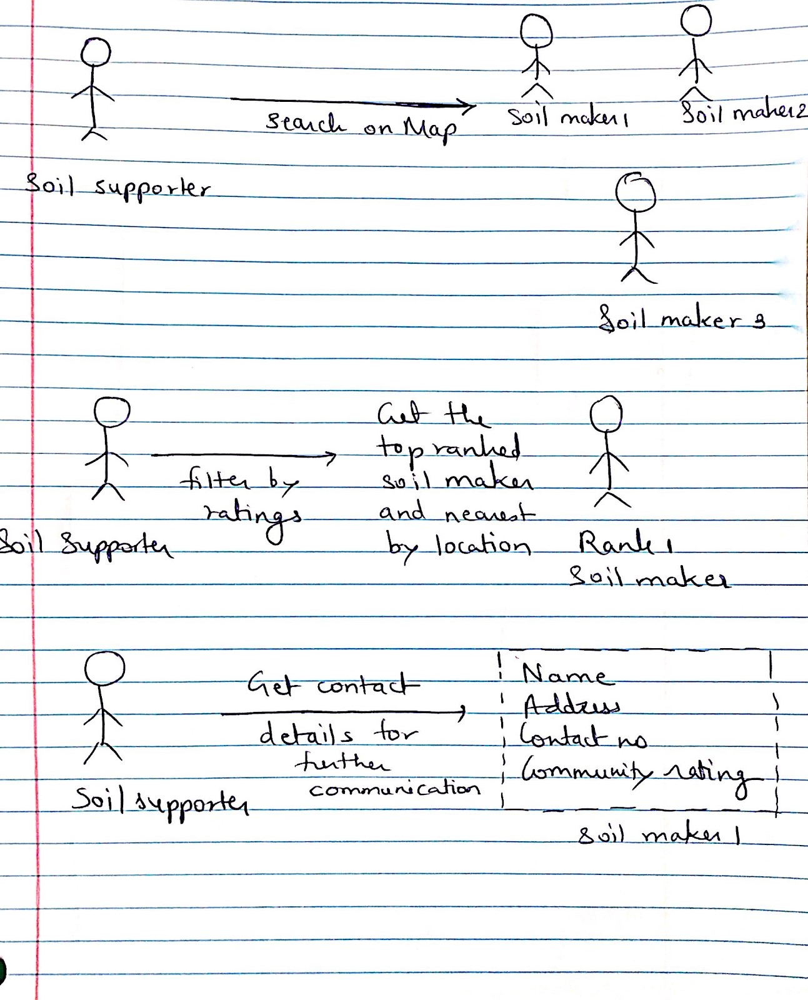

# Generate #

## Team ##

| Name                 	| Role		    | Contribution |
| :---                 	| :---         	| :---         |
| Gautami Khandekar	   	| Member | All involved  |
| Gang Zhang		   	| Member | All involved	 |
| Akanksha Singh	   	| Member | All involved  |
| Na Wen				| Member | All involved	 |
| Shikhar Sharma   		| Member | All involved	 |
| Xiangqing Ding		| Member | All involved	 |

## Products ##

| Products | Introduction | Highlight | Proposer |
| :---     | :---        | :--- | :---     |
| Chorewars | A web game designed for encouraging people to do chores. | Nobody like doing chores. However, changing chores into a game and give people virtual rewards would make chores interesting and encourage people to do it | Xiangqing Ding |
| Yelp      | An application that helps users find, select and review restaurants nearby | People can just click the points on the map, then small window will pop out to let them review the brief description of something. No new pages will be opened. | Xiangqing Ding |
| Verizon Coverage Map | Verizon has an online interactive coverage map | User may need a coverage map to see the soil maker within the specific coverage | Na Wen |
| Tutorial Video | General tutorial video | Since user may be confused about the application, adding tutorial videos may be a good choice | Na Wen |
| Facebook Group | Facebook users can join a Group and share their experience or ideas by posting | Soil supporter could from a community to share their donation experience. Soil maker could have a community to share their producing experience | Gang Zhang |
| News board |	General news board | The platform operator may need some place to make announcement or sharing news | Gang Zhang |
| Pokemon Go | A game that urges people to move to locations finding pokemon | Adding something in the map (like treasure) to encourage people to go outside to specific location | Shikhar Sharma |
| Snapchat | A popular application that lets the user share their short videos | User could share videos | Shikhar Sharma |
| Google Map | Google maps provide directions to travel to the desired destination | User could directly navigate to the location they select (no need for opening other navigation tools)  | Gautami Khandekar |
| Rotten Tomatoes | Rotten tomatoes is a site for movie reviews | User could rate the experience or other users | Gautami Khandekar|
| Medium | A platform for writers and thinkers to share fresh thinking and unique perspectives | User could share their experience and ideas | Akanksha Singh |
| Amazon | Amazon does a great job of providing recommendations unique to individual users | Providing recommendation to users will make they find what they need faster | Akanksha Singh |

## Ideas ##

### Idea Pool ###

| No | Description    | Area  | Proposer |
| :---  | :---     | :---   | :---    |
| 1 | Add game elements to the design of MakeSoil, like adding reward points, reputation, level or something else | Function - Motivation | Xiangqing Ding |
| 2 | The UI could be referred to the Yelp UI. It has some convenient design such as that a map showing all possible targets | Function - Map | Xiangqing Ding |
| 3 | Transfer contribution of soil supporter to other measurement, for instance, “You have donated 44 kg food waste, the soil made from that is 10kg. The grains grown on these soil could support  a family for three days” | Function - Data Display | Xiangqing Ding |
| 4 | Visualize the contribution of soil supporter into a line chart. The horizontal axis could be date and the vertical axis could be the weight of food donated | Function - Data Display | Xiangqing Ding |
| 5 | Create a coverage map just like verizon did for their signal coverage so user can have an idea on what to expect when start the process. | Function - Map | Na Wen |
| 6 | Give a tutorial including step by step process on what to do with those food waste as well as detail on what kind of food waste will be useful | Function - Tutorial | Na Wen |
| 7 | Form a community like facebook group to discuss make soil experience. | Function - Community | Gang Zhang |
| 8 | News feed page help users know what are going on recently in the community and neighborhood | Function - Community | Gang Zhang |
| 9 | Don’t just reward people with money but also with something trendy or dear to their sweet memories like the game pokemon go. MakeSoil  can use such a model to encourage people to drive to location where they can get soil. | Function - Motivation | Shikhar Sharma |
| 10 | MakeSoil can add a video feature to their phone app in future to let people share their makesoil stories | Function - Community | Shikhar Sharma |
| 11 | The MakeSoil app may be interfaced with the Google maps to help provide the soil makers with the navigation directions to the nearest soil supporters and soil couriers | Function - Map | Gautami Khandekar |
| 12 | The MakeSoil App can have soil maker ratings, based on the amount of soil and the quality of soil produced. This might help users decide whom to purchase the soil from | Function - Rating | Gautami Khandekar |
| 13 | Include a page that is similar to Medium where people can share their unique thoughts/ ideas/ experiences about making soil, creating a sustainable planet, why they do it, what inspires them etc in the form of articles | Function - Community | Akanksha Singh |
| 14 | Provide recommendations to each users based on past history, geographic location etc. Eg - Soil maker x needs y kgs of raw material | Function - Recommendation | Akanksha Singh |

### Best Ideas ###

After group discussion, we categorized the original ideas and select three of the ideas.

| Idea | Description    |
| :--- | :---     		|
| Map 			| 1. User could just view the detail on the map (may be a pop-out window)   2. User could set filter of the map (such as distance, zip code)  3. The map could have function of navigation  |
| Community		| 1. Platform owner/staff could make announcement, posting news in the community  2. Users could post articles about their experience, opinions in the community  3. Soil maker could post materials what they need in the community  4. In some posting there could be pictures or videos |
| Achievement	| 1. While soil supporter donates food waste, they will get virtual rewards (points) based on their donation  2. The user could review their contribution. The contribution graph could be a line chart  3. There could be ranking board for users based on their donation  4. There could be some medals for users with specific achievement (e.g. donate over 20 kg waste in one day)  |

## Variations ##

### Akanksha Singh (Idea: Community) ###

### Xiangqing Ding (Idea: Achievement) ###

### Gang Zhang (Idea: Map) ###

### Na Wen (Idea: Community) ###

### Gautami Khandekar (Idea: Map) ###

### Shikhar Sharma (Idea: Achievement) ###

## Storyboards ##

### Akanksha Singh (Idea: Community) ###

**Description:** 

+ The user can view different tabs (possibly different topics for articles), a few top/ trending articles. Additionally, there is a news feed to the right along with recommended readings based on your history. There are buttons for viewing your profile, notifications, and search.
+ Once the user clicks on the article, they can view who published the article, when was it published. They can also like the article and share it.
+ If the user decides to share it, they can share it via different mediums such as Facebook, Twitter, LinkedIn, Gmail.

### Xiangqing Ding (Idea: Achievement) ###

**Description:**

+ The user may intend to know their donation history and how much they contribute to the environment.
+ The application should have a main page for each user, containing profile, contribution and achievement.
+ The contribution is like a line chart with date as horizontal axis and weight of donation as vertical axis.
+ In the achievement page, there is achievement (medal) the user own. It also shows achievement that is unlocked to motivate people to contribute. 

### Gang Zhang (Idea: Map) ###

**Description:**

A soil supporter use the app to find the way to the nearest soil maker

### Na Wen (Idea: Community) ###

**Description:**

Two user can chat before making a MakeSoil connection, so the soil supplier can request location where to drop of the food waste for soil maker.

### Gautami Khandekar (Idea: Map) ###

### Shikhar Sharma (Idea: Achievement) ###

## References ##

MakeSoil Official Website: [http://makesoil.org/](http://makesoil.org/)

