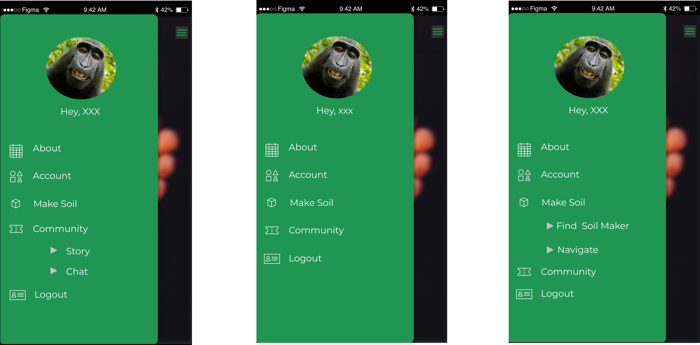
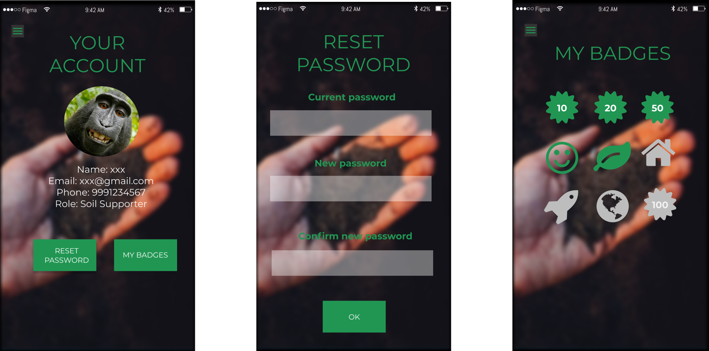
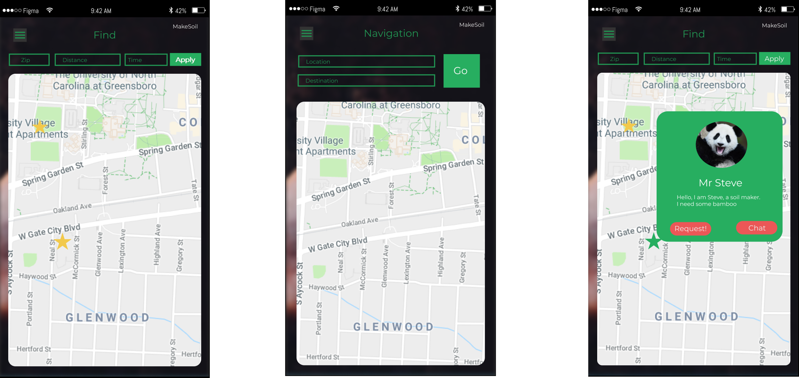
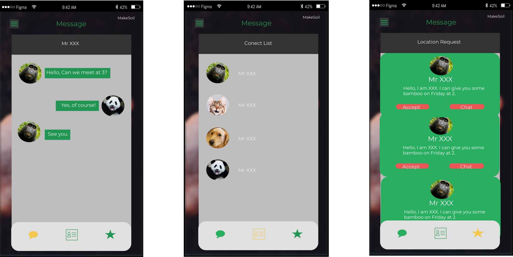
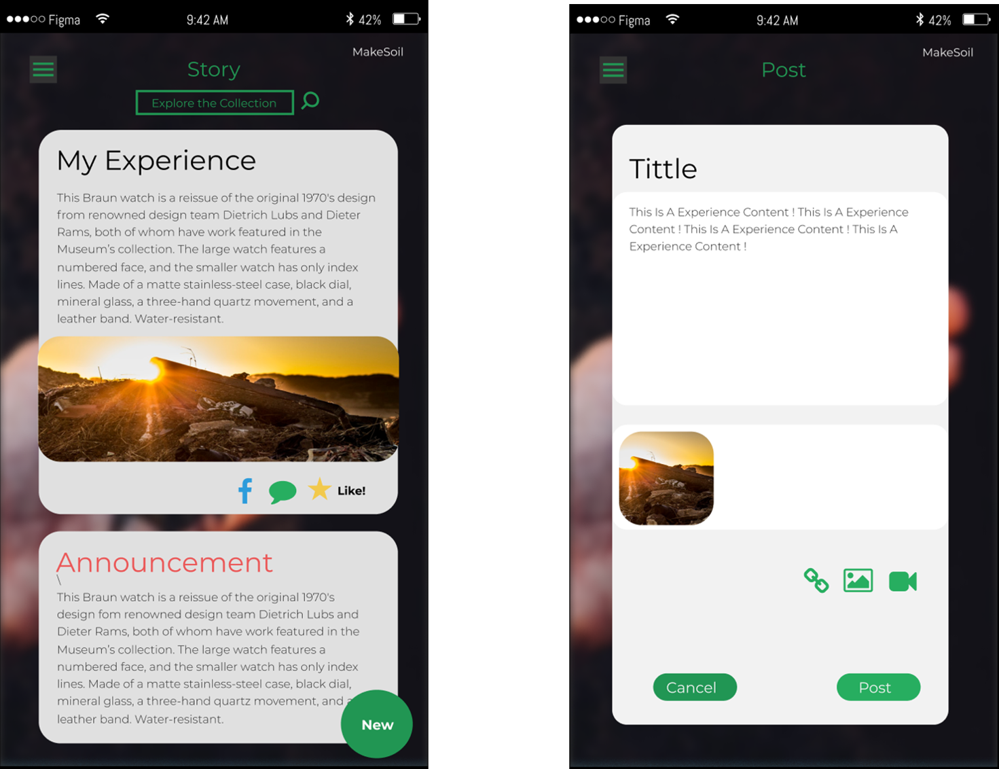

# Prototype #

## Team ##

| Name                 	| Role		    | Contribution |
| :---                 	| :---         	| :---         |
| Gautami Khandekar	   	| Member 		|  All Involved |
| Gang Zhang		   	| Member 		| 	All Involved |
| Akanksha Singh	   	| Facilitator 	|  All Involved |
| Na Wen				| Member 		| 	All Involved |
| Shikhar Sharma   		| Member 		| 	All Involved |
| Xiangqing Ding		| Member 		| 	All Involved |

## Tools ##

| Tool                 	| Role		    |
| :---                 	| :---         	|
| Figma	   				| Main Interface Design Tool |
| Wireframe.cc 			| Tool used for wireframe design |
| Google doc   			| Tool used for collaborating document |
| Trello				| Tool used for task assignment and scheduling |
| WhatsApp	   			| Tool used for group discussion |
| Slack	   				| Tool used for discussing with client  |

## Task Distribution ##

The prototypes are divided into three parts based on our design: Main pages(Log in and Account), Community, and Map. Each two group members are assigned with on one part according to their preference. In addition, everyone could modify others' section if they think there is something to improve.

## Prototypes ##

### Pages ###

#### Main Pages ####

Main pages are pages about registration and logging in. When users open the application, they could choose to sign in, sign up, or try the application without logging in. In addition, as most applications, users could choose to retrieve their password if they forget it.   

#### Menu ####

After logging in, users could open menu by clicking the button on upper-left corner of the screen. There are also sub-sections of "Community" and "Make Soil"

#### Account Pages ####

By clicking the Account option in the menu, users could go to the account page and review their profile. In addition, users could reset their password or see the badges the get by clicking corresponding buttons. 

#### Map ####

Map pages are the main interfaces of the application. Based on that, users could find soil maker and support them. The point on Map is not accurate location of soil maker for the consideration of privacy. User could see detail of the pile by clicking the point on the Map. Also, users could also navigate to the places they want. 

#### Chatting ####

Users could chat with each other, making friends and accepting request.

#### Community ####

In Community pages, user could read, comment, like and forward posts from all users. Also, they can post their own experience. In the posting, they could inset pictures, videos and links.

### Workflow ###

The whole prototype starts from the Main page. The arrow in the image usually starts with a button and ends with a new page, which shows how pages are linked.

### Working URL ###

[https://www.figma.com/proto/WQrw6jg5ppeUr4oJ3YXsfUjj/Phone](https://www.figma.com/proto/WQrw6jg5ppeUr4oJ3YXsfUjj/Phone)

## Problem ##

As we built the prototypes, we found several problems, as listed below:

+ The biggest problem is that, it is hard to present work flow of the prototype using Figma. Extra time is needed to explain how the design work to our clients.
+ Hard to add some basic UI element (like Checkboxes, Toggles) in Figma. As a result, the design cannot fully present some of our thought.
+ All team members collaborating on the same stage of the project and no branch function in Figma, making it hard to compare different ideas.

## References ##

MakeSoil Official Website: [http://makesoil.org/](http://makesoil.org/)

Original Report: [https://github.com/MakeSoil-UX/Prototype](https://github.com/MakeSoil-UX/Prototype)
